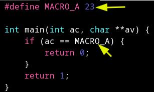
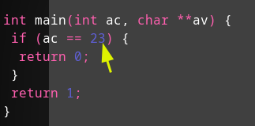
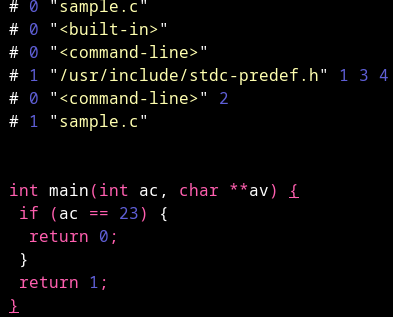
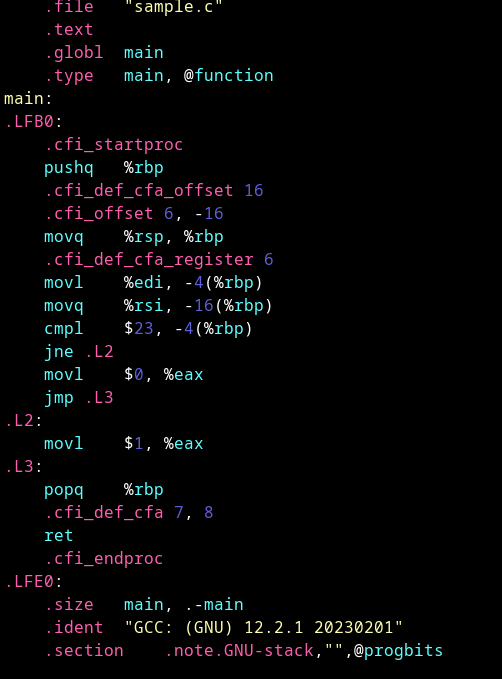
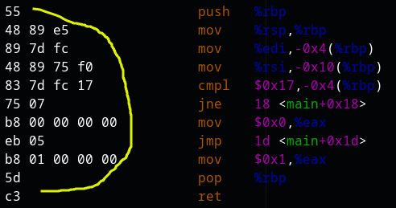
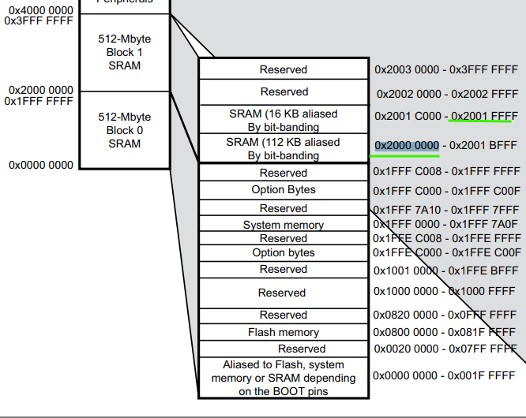
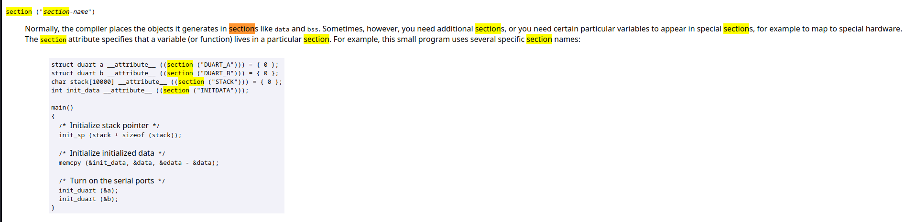
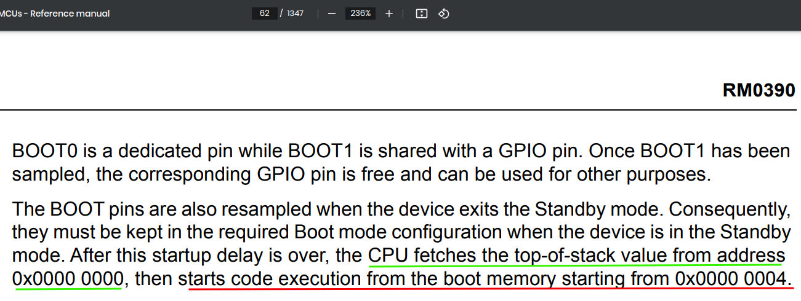

### Bare Metal Stm32

##### *Build Process*

**Pre-Processing**



```
all macros are resolved at this stage
```

after pre-precosseing



**Code Generation**

```
at this point we got the pre-processed file and we 
convert it to assembly language
```

before



after



**Assembler**

```
assembly mnemonics are converted to opcodes
output will relocatble object file *.o
```

before


after



#### Linker

```
when we get the relocatble files linker combine them
and give us one binary file
```

#### Memeory map



##### *Complier attibutes*



