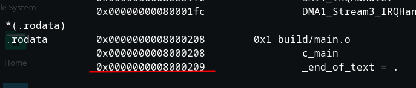
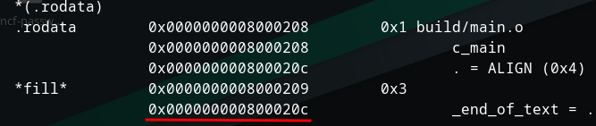

### Bare Metal Stm32

##### *Build Process*

**Pre-Processing**


```
all macros are resolved at this stage
```

after pre-precosseing


**Code Generation**

```
at this point we got the pre-processed file and we 
convert it to assembly language
```

before


after


**Assembler**

```
assembly mnemonics are converted to opcodes
output will relocatble object file *.o
```

before


after


#### Linker

```
when we get the relocatble files linker combine them
and give us one binary file
```

#### Memeory map


##### *Complier attibutes*


#### *linker Script*

```
linker script is text file which explains how sections of the object files
should be merged to create final binary
```

#### Align keywork in linker script

###### *Before*


###### *After*



###### **GDB AND OPENOCD**

````
first make sure that openocd is running
````

- arm-none-eabi-gdb
- target remote localhost:3333
- monitor reset init
- monitor write_image erase path/to/binary
- monitor reset halt
- monitor resume


